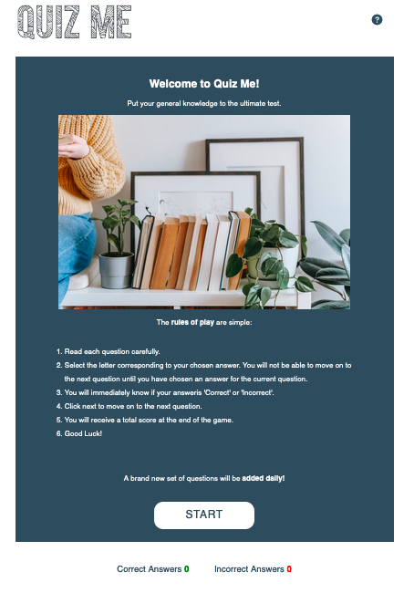

# Quiz Me

Quiz Me is a general knowledge quiz website designed for users to put their knowlege to the test. Each day a new set of questions will be released. Users will be able to share their score with friends and family. There will also be a running score page with the top 100 players listed within the last 30 days.

The live link can be found here: [Quiz Me](https://tamsincraddock.github.io/project-2/)

## Existing Features:
---

### Welcome pop-up page:
-  This is a landing page to welcome the user to the website. The welcome page will also serve the purpose of giving the user an overview of how to use the application.

- Question game play area: This is the section of the game. Each question will be displayed here one at a time and the user will need to select an answer (either option A, B, C or D) before they are able to click the 'next' button to move on to the next question.

- Question mark (help) button: This button is displayed at the top right hand side of the page and will be a tool that the user could use throughout the game as a reminder about the game rules and 'how to play'.

- Score totals area: This section will be displayed throughout the game questioning process and serves to display the running total score throughout the game.

- The end-game message: This message will appear at the end of the 10 questions. The user will either be shown a message saying "Better Luck Next Time" or "Congratulations!" depending on how they score in the game.

### The Landing Page Image:
- The landing includes a photograph with text overlay to allow the user to see exactly which location this site would be applicable to.

### Our Values Section:
- The Our Values section would allow the user to see the benefits of using Happy Tails.

### Our Services Section:
- The Our Services section gives the user an overview of the services offered by Happy Tails. There is also a description below each service heading to give a more in depth explination of the service offered.

### Summary section:
- The Expert Dog Walking Service summary section serves to summarize why you should choose to use Happy Tails. It also explains a few different service options that may appeal to the user.

### The Footer:

- The footer section includes links to the relevant social media sites for Happy Tails. The links will open to a new tab to allow easy navigation for the user.
- The footer is valuable to the user as it encourages them to keep connected via social media

### The Pricing Page:
- The pricing page provides the user with a breakdown of the prices for all the services on ffer. Here the user would be able to see an exact price for the service they would be looking to use.
- The price per walk or visit also becomes more cost effective if the user decides to move up to more days per week. This could also be used as an 'up-sell' feature.

### Gallery:
- The gallery will provide the user with supporting images to see what services we offer.
- This section is valuable to the user as they will be able to easily identify the benefits to using our services.

### Contact Us Page:
- This page allows the user to fill out a contact form so that Happy Tails would be able to get in touch with the customer and answer any questions that they may have or get them to sign up to the service.

### Thank You for your message:
- This page is shown once the user has filled out the contact form. 
- This page serves to show the user that their message has been successfully sent and that Happy Tails will respond to their message as soon as possible.

------

### Features Left To Implement:
- In the future, we could look at adding an automatic online booking system that would allow users to make bookings using the website.

-------

## Testing:

- Media queries have been added for small and medium screen sizes. This means that the website should be easily readable and functional across a wide range of devices. The overall design was completed on a desktop size screen (large), therefore the website design and media queries should cover all standard screen size widths and orientations.

- I tested that this page works in different browsers: Chrome, Firefox, Saari.

- I confirmed that this project is responsive, looks good and functions on all standard screen sizes using the devtools device toolbar.

- I confirmed that the navigation, header, pricing page, gallery and contact us page are all readable and easy to understand.

- I have confirmed that the form works. Required fields have been added to essential information needed to contact the customer. A valid email address only works in the email address field. The submit button works and takes the user to a seperate thank you page.

### Validator Testing:
- HTML:
    No errors were returned when passing through the official W3C validator

- CSS:
    No errors were returned when passing through the official W3C CSS Validator (Jigsaw)

    ------

    ## Deployment:

    This site was deployed to GitHub Pages. 

    The live link can be found here: [Hapy Tails](https://tamsincraddock.github.io/project-1/)

    -----

    ## Images:
    - The images throughout the website were taken from [Pexels](https://www.pexels.com/) (Royalty Free Images).
