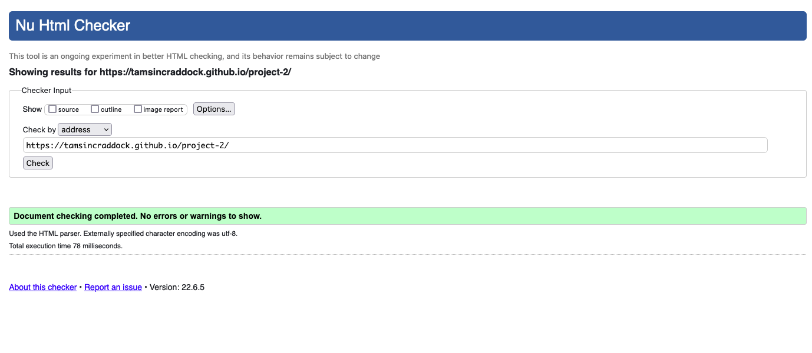

# Quiz Me

Quiz Me is a general knowledge quiz website designed for users to put their knowlege to the test. Each day a new set of questions will be released. Users will be able to share their score with friends and family. There will also be a running score page with the top 100 players listed within the last 30 days.

The live link can be found here: [Quiz Me](https://tamsincraddock.github.io/project-2/)

## Existing Features:
---

## Welcome pop-up page:
-  This is a landing page to welcome the user to the website. The welcome page will also serve the purpose of giving the user an overview of how to use the application.

## Question game play area:
- This is the section of the game. Each question will be displayed here one at a time and the user will need to select an answer (either option A, B, C or D) before they are able to click the 'next' button to move on to the next question.

## Question mark (help) button:
- This button is displayed at the top right hand side of the page and will be a tool that the user could use throughout the game as a reminder about the game rules and 'how to play'.

## Score totals area:
- This section will be displayed throughout the game questioning process and serves to display the running total score throughout the game.

- Correct answers will be shown in green and Incorrect answers will be shown in red.

## The end-game message:
- This message will appear at the end of the 10 questions. The user will either be shown a message saying "Better Luck Next Time" or "Congratulations!" depending on how they score in the game.

------

## Features Left To Implement:
- In the future, I would like to implement a score board showing the top players within a time period (eg. top scoring players within the last 30 days). Each player would have their profile scored daily based on their totals within the score time frame.

- Another feature that I'd like to implement going forward would be a way for the user to share their score. This would be via Social Media channels & email.

- A feature that I very much wanted to add to the website is an image that would display depending on the users' outcome.
    - For a game with the "Better Luck Next Time!" message, the below image would display:

- For a game with the "Well done!" message, the below image would display:

-------

## Testing:

- Media queries have been added for small screen sizes. This means that the website should be easily readable and functional across a wide range of devices. The overall design was completed on a desktop size screen (large), therefore the website design and media queries should cover all standard screen size widths and orientations.

- I checked to see if media queries are required for medium size screens. However all functionality and design looked to be working and displayed correctly n medium size screens. Therefore no media queries have been added for these screen sizes.

- I tested that this page works in different browsers: Chrome, Firefox, Saari.

- I confirmed that this project is responsive, looks good and functions on all standard screen sizes using the devtools device toolbar.

- I confirmed that the welcome pop up page, logo, help pop up page, game area and end-game page are all readable and easy to understand.

## Validator Testing:
### HTML:
Upon my initial testing using the W3C validator, I found an error where I forgot to add an 'alt' attribute to one of my images added to the website.

I corrected this issue and ran the validator check once more. The report showed no more issues.

### CSS:
No errors were returned when passing through the official W3C CSS Validator (Jigsaw)

 ### Javascript:

 Initially when I ran the Javascrit through the jshint validator, it returned 9 warnings. 

 

 Once I had worked through the issues, I ran the validator check again and it has still returned two errors that I unfortunately was not able to solve.

 ------

 ## Deployment:

This site was deployed to GitHub Pages. 

The live link can be found here: [Quiz Me](https://tamsincraddock.github.io/project-2/)

-----

## Images:
- The images throughout the website were taken from [Pexels](https://www.pexels.com/) (Royalty Free Images)

-----

## Refrences & credits:
- Questions for general knowledge game: https://www.cosmopolitan.com/uk/worklife/a32388181/best-general-knowledge-quiz-questions/

- Research for CSS/ Html & Javascript code:
    - https://www.w3schools.com/
    - https://stackoverflow.com
    - https://learn.codeinstitute.net/ci_program/diplomainfullstacksoftwarecommoncurriculum (Code Institute course notes and examples)
